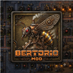

# Bertorio

A small **Factorio 2.0** mod: a craftable, upgradeable **pickaxe** that speeds
up hand-mining — plus a lightweight **framework** for docking further features
onto. Built and tested against Factorio **2.0.77**.

## Features

- **Pickaxe (Mk1–Mk3)** — craft `Pickaxe Mk1` from iron plates; upgrade to Mk2
  and Mk3. Equipped, it boosts hand-mining speed: **Mk1 ×2, Mk2 ×3, Mk3 ×4**.
- **Equip slot** — open the character screen (`E`); a *Pickaxe* slot appears on
  the right. The bonus applies **only while a pickaxe is equipped there** —
  carrying it loose in the inventory does nothing. Equipping takes it out of
  your inventory; clearing the slot returns it.
- **Upgrade materials drop while mining** — hand-mining ore has a chance to
  yield *Alloy* (for Mk2) and *Crystal* (for Mk3), with a floating popup on
  each find.
- **`/bertorio-cheat`** — gives a test kit (100 iron plates + 50 Alloy +
  50 Crystal) so you can try everything without grinding.
- **Stats window** — a top-left *Bertorio Stats* button shows ore mined,
  materials collected, and your streak toward the next guaranteed drop.
- **Cycle hotkey** — bind *Cycle Bertorio pickaxe* in Controls to swap tiers
  without opening the character screen.
- **Quality** — a pickaxe's quality level counts as +1 tier (capped at Mk3).
- Per-tier speed and the pity guarantee are configurable in Map settings.
- **Feature framework** — features are self-contained folders loaded from a
  registry; adding one is a folder + one line (see below).

## How it works

Mining speed is driven by `force.manual_mining_speed_modifier`. This is a
**force-wide** value, so the bonus is shared by the whole team and reflects the
highest pickaxe tier currently equipped by any force member — per-player speed
is not possible in the engine without swapping character prototypes.

## Installation

**As a player**

1. Get `bertorio_0.1.0.zip`.
2. Drop it into your Factorio mods folder:
   `%APPDATA%\Factorio\mods\` (Windows) ·
   `~/.factorio/mods/` (Linux) · `~/Library/Application Support/factorio/mods/` (macOS).
3. Start Factorio, enable **Bertorio** in the Mods list.

**From source (dev)**

Link this repo into the mods folder as a folder named `bertorio`:

    mklink /J "%APPDATA%\Factorio\mods\bertorio" "E:\path\to\Bertorio"   :: Windows junction
    ln -s /path/to/Bertorio ~/.factorio/mods/bertorio                    # Linux/macOS

## Recipes

| Item | Cost |
|------|------|
| Pickaxe Mk1 | 10 × iron plate |
| Pickaxe Mk2 | Pickaxe Mk1 + 10 × Alloy |
| Pickaxe Mk3 | Pickaxe Mk2 + 10 × Crystal |

All recipes are available from the start (no research).

## Settings (Map / runtime-global, changeable in-game)

| Setting | Default | Meaning |
|---------|---------|---------|
| Pickaxe Alloy drop chance | 0.04 | chance per ore mined to drop an Alloy |
| Pickaxe Crystal drop chance | 0.01 | chance per ore mined to drop a Crystal |

A drop is also **guaranteed at least once per `ceil(1/chance)` ore** (a pity
counter), so bad luck can't starve you: with the defaults that's ≥1 Alloy per
25 ore and ≥1 Crystal per 100 ore.

## Console commands

- `/bertorio-cheat` — adds the test kit. Note: like all console commands, this
  disables achievements for the save.

## Adding a feature (framework)

1. Create `features/<name>/data.lua` and `features/<name>/control.lua`
   (`control.lua` returns an [`event_handler`](https://lua-api.factorio.com/)
   library table; an unused stage is an empty stub).
2. Add `"<name>"` to `features.lua`.

`data.lua` (root) loads every feature's data stage; `control.lua` (root)
registers every feature's control lib through the core `event_handler` library.

## Development

- **Logic tests** — pure helpers in `features/pickaxe/logic.lua` are unit-tested
  with standalone Lua:

      cd features/pickaxe && lua test_logic.lua

- **Package a release zip** — zip the mod files under a top-level `bertorio/`
  folder named `bertorio_<version>.zip` (exclude `docs/`, `.git/`).

## Known limitations

- Mining speed is **force-wide**, not per-player (engine limit).
- Pickaxe icons currently carry a grey background until transparent-alpha
  source art is provided.
- Equipping consumes a *normal*-quality pickaxe; a quality-only stock isn't
  consumed yet (edge case).

## Changelog

See [`changelog.txt`](changelog.txt) (Factorio in-game changelog format).

## Compatibility

Factorio 2.0 (developed on 2.0.77). Depends only on `base`.
